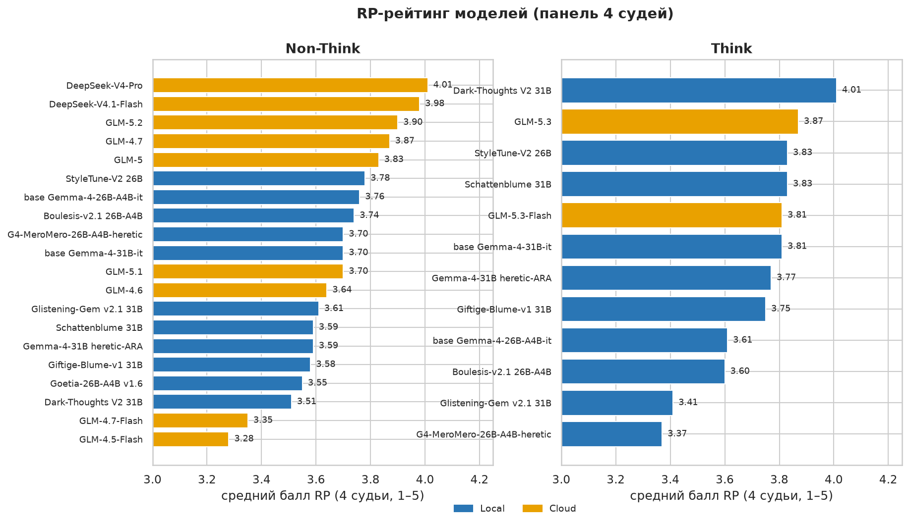
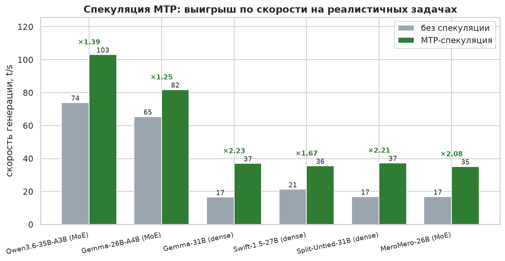
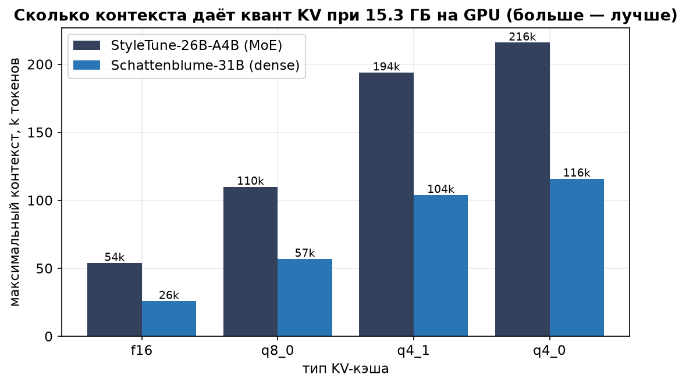

# GGUFLauncher — проверенные конфиги запуска локальных LLM (llama.cpp)

Здесь лежат **готовые конфиги** для llama.cpp, отобранные бенчмарками на реалистичных задачах
(RP/чат, код, математика, суммаризация — без повторяющихся промптов), плюс рекомендации под
разные видеокарты и задачи.
Тестовый стенд: **RTX 4060 Ti 16 GB, Ryzen 7 5700X, 32 GB RAM, Windows**.
Логи исследований по каждой модели — в `docs\`, сырые замеры — в `bench\runs\results.jsonl`.
**Что уже проверено и не требует повторов — `docs\researched.md`.**

## Быстрый старт

1. Скопируйте `config.example.bat` в `config.local.bat` и укажите свои пути:
   `LLAMA_SERVER` (llama-server.exe), `MODELS_DIR` (папка с моделями), при необходимости `LLAMA_DIR`.
   Выпуск llama.cpp можно взять из `downloads\llama-b11382-cu124\` или использовать свой.
2. Выберите `.bat` из таблицы ниже под свою модель и задачу — они берут пути из `config.local.bat`.
3. Запустите и проверьте строку `listening on http://...` в консоли.

Не хочется выбирать `.bat` на каждую модель? Поднимите **router-режим** — один сервер
обслуживает все модели, что есть на ПК; клиент выбирает её по имени в запросе:
`launch\router\run-router.bat`. Для RP — отдельный `launch\router\run-rp-router.bat`
(порт 9932, только проверенные RP-модели). Подробности — `docs\research\router-mode.md`.

## Готовые конфиги (`.bat`)

Скорость генерации (t/s) на **реалистичных** задачах, сборка b11382, 16 ГБ: RP / обычный чат /
код / математика. Датасет — `bench\requests_real.json`.

| Модель | RP | Чат | Код | Матем | Конфиг |
| --- | ---: | ---: | ---: | ---: | --- |
| **Qwen3.6-35B-A3B** (MoE 3B акт., Q2_K_XL) | **82** | **93** | **111** | **121** | `launch\b11382-cu124\qwen36-35b-a3b\qwen36-35b-a3b-mtp-b11382.bat` |
| **Gemma-4-26B-A4B Goetia v1.6** (MoE, IQ3_XXS, RP-мерж) | **~73** | — | — | — | `...gemma4-26a4b-goetia-nothink-b11382.bat` (think непригоден) |
| **Gemma-4-26B-A4B StyleTune** (MoE, IQ4_XS) | **63**¹ | 70 | 100 | 107 | RP — `...styletune-nothink-nospec-b11382.bat`; чат/код — `...styletune-b11382.bat` |
| **Gemma-4-26B-A4B Boulesis v2.1** (MoE, IQ4_XS, RP-мерж) | **55**² | — | — | — | `...gemma4-26a4b-boulesis-v21-nothink-b11382.bat` (+ `-think`) |
| **Qwen3.6-27B Fable-Fusion-711** (dense, IQ2_M, heretic-мерж) | **18**³ | 18 | 19 | 20 | `launch\b11382-cu124\qwen36-27b\qwen36-27b-fable-fus-711-nothink-b11382.bat` (+ `-think`, `-author`, `-mtp`) |
| Swift-1.5-Qwen3.8-27B (dense, IQ2_S-mtp) | 28 | 37 | 36 | 37 | `launch\b11382-cu124\swift\swift-best-b11382.bat` |
| **Gemma-4-31B Glistening-Gem v2.1** (dense RP-мерж, IQ3_XXS) | 23 | — | — | — | `...gemma4-31b-glistening-nothink-b11382.bat` (+ `-think`) |
| Gemma-4-31B Dark-Thoughts V2 (dense, IQ3_XXS) | 23 | 31 | 48 | 47 | `...gemma4-31b-dark-thoughts-nothink-b11382.bat` (+ `-think`) |
| **Split-Untied-31B** (dense RP-мерж, IQ3_XXS) | **23** | 34 | 47 | 46 | `...-split-untied-nothink...`; RU — `...-nothink-ru...`; think — `...-think...` |
| **Gemma-4-31B Giftige-Blume-v1** (dense RP-мерж, IQ3_XXS) | 22 | — | — | — | `...gemma4-31b-blume-v1-nothink-b11382.bat` (+ `-think`) |
| **Gemma-4-31B Schattenblume** (dense RP-мерж, IQ3_XXS) | 22 | — | — | — | `...gemma4-31b-schattenblume-nothink-b11382.bat` (+ `-think`) |

¹ У Gemma-26B на RP спекуляция **не окупается** (креатив плохо предсказуем): без MTP 63 t/s,
с MTP ~50. Остальные числа — с MTP.
² У Boulesis измерен только RP (55 t/s из харнесса `rp_quality.py`, не из `requests_real.json`);
чат/код/математику не гоняли. Контекст `-c 51200` — при 14.3 ГБ модели 65536 уже впритык по VRAM.
³ У Qwen3.6-27B Fable-Fusion-711 RP измерен **без спекуляции — 17.8 t/s** (с MTP на RP 13.5:
спекуляция вредит); код/математика — с MTP 19/20 t/s, чат 18. Кодинг-профиль — `...-mtp-b11382.bat`.
`-c 51200` при 11.3 ГБ — есть запас по VRAM.
«—»: у 31B RP-мержей мерили только RP (чат/код/математику не гоняли). Отбракованы (`.bat` есть,
но **не рекомендуются**): `gemma4-31b-styleswap-*` (англ. вставки в русский), `gemma4-31b-artemis-*`
(речевая каша), `gemma4-26a4b-meromero-*` (NoThink ниже базы Gemma-26B: повторы и слабая память;
think непригоден — утечка reasoning), `gemma4-26a4b-kitchoon-*` (слабейший из 26B-мёржей: провал
памяти — принимает ложный «Питер», шаблоны; think сломан — утечка английского reasoning) и
`dans-pers13-*` (**не** character-RP: «быстрое согласие», персонаж слабый; но русский держит чисто —
годится как чат-компаньон). Полный список файлов — `launch\b11382-cu124\`.

Код-профили `*-dflash-code.bat` (DFlash+ngram) полезны для правок/копирования больших файлов;
на этом наборе они не перепроверялись — см. `docs\research\speculation-research.md`.
Конфиги старой сборки (10472) удалены — используются только сборка b11382 (`launch\b11382-cu124\`).

## Рекомендованные модели по задачам

Только модели, которые реально запускались и измерялись в этом репозитории (логи — `docs\`).
Конфиги — в `launch\b11382-cu124\`. Нетестированные кандидаты — в `docs\research\rp-model-candidates.md`
(это не рекомендация, а задел).

**Что здесь измерено:** скорость (t/s), языковые артефакты и — с 2026-10 — связность RP через
LLM-судью на «мнимой истории» (`docs\quality\rp-quality-eval.md`). Итоговые RP-предпочтения всё равно
согласовывать с пользователем (см. `AGENTS.md`).

| Задача | Модель | Что измерено | Конфиг |
| --- | --- | --- | --- |
| **RP / креатив (качество)** | **Giftige-Blume-v1-31B (NoThink)**; Schattenblume-31B; Dark-Thoughts V2-31B; Glistening-Gem-31B-v2.1 | LLM-судья на «мнимой истории» (`docs\quality\rp-quality-eval.md`): Blume **4.33** (Qwen 3.35) — лучшая **инициатива (4.0)**; лидеры 4.3–4.5 | `gemma4-31b-blume-v1-nothink-b11382.bat`, `gemma4-31b-schattenblume-nothink-b11382.bat`, `gemma4-31b-dark-thoughts-nothink-b11382.bat`, `gemma4-31b-glistening-nothink-b11382.bat` |
| **Русский язык (наш тест)** | Dark Thoughts V2; StyleTune-26B; WaifuGemma4-26B; **Giftige-Blume-v1 / Glistening-Gem-v2.1** | чистота: 96–100 % / 96–100 % / 96 % / **Cyr 99.9 % и 100 %**. StyleTune-31B и Giftige-Blume-StyleSwap — **непригодны** (англ. вставки). Split-Untied 75 % → 96 % с RU-пресетом | `gemma4-31b-dark-thoughts-nothink-b11382.bat`, `gemma4-26a4b-styletune-nothink-nospec-b11382.bat`, `gemma4-26a4b-waifugemma-nothink-b11382.bat`, `gemma4-31b-blume-v1-nothink-b11382.bat`, `gemma4-31b-glistening-nothink-b11382.bat` |
| **Код / агенты / рефакторинг** | Qwen3.6-35B-A3B + DFlash+ngram | +18 % рефакторинг, +44 % новый код к MTP | `qwen36-35b-a3b-dflash-code.bat` |
| **Чат** | Qwen3.6-35B-A3B | 93 t/s | `qwen36-35b-a3b-mtp-b11382.bat` |
| **Математика** | Qwen3.6-35B-A3B | 121 t/s | там же |
| **Длинные документы / суммаризация** | Qwen3.6-35B-A3B (131k); Gemma-4-26B-A4B | PP ~800–1700 t/s | `qwen36-35b-a3b-mtp-b11382.bat`, `gemma4-26a4b-styletune-b11382.bat` |
| **Dense — скорость на RP** | Gemma-4-31B Dark-Thoughts V2; Swift-1.5-27B | 23 / 23 / 28 t/s | `gemma4-31b-dark-thoughts-nothink-b11382.bat`, `...-split-untied-*`, `swift-best-b11382.bat` |



## Какая у вас видеокарта?

**16 ГБ (как на стенде, проверено)** — берите конфиги выше как есть. Запаса VRAM хватает
на 51k–131k контекста в зависимости от модели.

**12 ГБ** — ориентиры: кванты на 9–12 ГБ (IQ2_S/Q2_K, IQ3_XXS), контекст 32–64k, KV-кэш `q4_0`,
`--fit on` сам разложит слои. Часть модели может уйти на CPU — это замедлит генерацию,
поэтому спекуляция (MTP) становится особенно важной: она даёт +50…150 % и частично компенсирует.

**8 ГБ** — реально запускать модели 7–9B в квантах IQ2/Q2 или MoE-модели (у них активных параметров мало).
Контекст 16–32k, KV `q4_0`. Выгрузка экспертов/слоёв на CPU неизбежна — `--fit on` справится сам.
Спекуляция и `cache_prompt` тут дают максимальный эффект.

**24 ГБ+** — всё влезает с запасом: можно поднять KV до `q8_0`/f16, держать контекст 131k+ и включить
vision на GPU. Отдельно перепроверьте EAGLE-3/DSpark — на старших картах их оверхед может окупиться
(на 16 ГБ Ada они проиграли MTP), а DFlash-профили должны стать ещё выгоднее.

*Оговорка: 12/8/24 ГБ мы не измеряли — это ориентиры, выведенные из замеров на 16 ГБ.*

## Разные задачи — разные конфиги

### Кодинг, агенты, рефакторинг
- **Qwen3.6 + DFlash + ngram** (`qwen36-35b-a3b-dflash-code.bat`) — реальный выигрыш на коде:
  рефакторинг **+18 %**, новый код **+44 %** к MTP, на RP не хуже. Но ест больше VRAM (~15.3 ГБ).
- **Gemma-26B + DFlash + ngram** на реалистичном коде **проигрывает** MTP (−17 %) — берите
  `gemma4-26a4b-styletune-b11382.bat`, а не `-dflash-code`.
- Длинные агентные сессии: контекст 131k (Qwen3.6, вариант Gemma-26B в комментарии конфига).
- Мультитёрн: клиент **обязан** слать `cache_prompt: true` — тогда PP падает с тысяч токенов до ~100
  (кэш переиспользуется), а TG держится.
- Инструменты/функции: шаблоны моделей их поддерживают; у Gemma-4 в конфиге включён `gemma4.jinja`.

### RP, креатив, свободные диалоги
- **Готовый RP-роутер:** `launch\router\run-rp-router.bat` (порт 9932) — только проверенные
  RP-модели (4 лидера 31B + быстрые StyleTune/Goetia), выбор по имени в поле `model`;
  состав и оговорки — `docs\research\router-mode.md`.
- **Качество RP (LLM-судья, «мнимая история»):** методика и все числа — `docs\quality\rp-quality-eval.md`;
  харнесс `bench\rp_quality.py`, судьи — `gemma-4-26B-A4B` (мягче) и `Qwen3.6-35B-A3B` MXFP4 (строже).
  Текущие лидеры (NoThink, полный набор 6 сценариев, средний двух судей): **Giftige-Blume-v1 — 4.33 / 3.35**
  (№1 по Caliper Combined и DarkRP; лучшая **инициатива 4.0**), Schattenblume 4.38/3.28, Glistening-Gem
  v2.1 4.33/3.35, Dark-Thoughts V2 4.24/3.11. Все держат русский чисто.
- **Витрина выбора (панель 4 судей, 2 сцены)** — `docs\quality\rp-ranking.md`. Лучший 26B-мёрж —
  **Boulesis-v2.1-26B-A4B**: Non-Think **3.74** (~55 t/s, русский чистый), Think 3.60;
  `...gemma4-26a4b-boulesis-v21-nothink-b11382.bat` (+ `-think`).
- **Qwen3.6-27B Fable-Fusion-711** (dense heretic-мерж, IQ2_M, ~18 t/s без спекуляции) — **середина по RP (панель
  3.46, No ≈ Think)**: русский — лучшая ось (Чисто/Cyr 100 %), но персонаж сглажен, инициатива слабая,
  повторы между сидами; think дублирует ответ. **MTP на RP замедляет** (13.5 против 17.8 t/s), поэтому RP — без
  спекуляции, а код/чат — `...-mtp-b11382.bat`. **Не апгрейд**, но годная RU-модель общего профиля:
  `qwen36-27b-fable-fus-711-nothink-b11382.bat` (+ `-think`, `-author`).
- **Отбраковано по RP:** Artemis-31B-v1.2 (речевая каша при «Чисто 100 %»), Giftige-Blume-**StyleSwap**
  (русский 3.3/2.6 — прививка головы StyleTune течёт в английский), StyleTune-31B.
- **Базовые instruct-модели на RP** (скрин + полный набор, 2026-10-07): **Gemma-4-26B-A4B-it** —
  пригодный baseline: у строгого судьи на 2 сценах выше DTV2/Schattenblume, на полном наборе **3.28 —
  вровень со Schattenblume**, выше DTV2; слабости — повторы метафор, «сдача» в соблазне, сломанный think.
  **Qwen3.6-35B-A3B и Qwen3.8-27B — слабо** (коротко, сухо, пассивно; think нестабилен).
  Числа — `docs\quality\base-models-rp-eval.md`.
- Think у 31B-мержей капризен: часть ответов пустая (незакрытый `<channel|>`); у Blume безлимит бюджета
  слегка уменьшает пустые, но качества не добавляет — рабочий режим **NoThink**.
- Итоговые RP-предпочтения — за пользователем. **Базовый** Qwen3.6-35B-A3B и Swift-1.5 в RP не рекомендуются.
  Скорости RP-моделей — ~21–31 t/s (в таблице выше; Qwen3.6 быстрее всех, но это не про качество).
- **Русский текст (наш тест):** Dark Thoughts V2 — 96–100 % чистых, StyleTune-26B — 96–100 % и втрое
  быстрее (69 t/s); Split-Untied слабее (75 %) — лечится `temp 0.4` (96 %) или грамматикой (100 %).
- Dense-модели на RP заметно медленнее: Swift-1.5 ~28, Gemma-4-31B ~23 t/s. MTP и тут полезен
  (+30…40 % к «без спекуляции»), но это потолок dense-модели на 16 ГБ.
- **Частный случай:** у Gemma-4-26B-A4B на RP спекуляция *вредит* (без MTP 63 t/s, с MTP ~50).
  Берите `launch\b11382-cu124\gemma4-26a4b\gemma4-26a4b-styletune-nothink-nospec-b11382.bat`
  (`--reasoning off`, без MTP).
- Сэмплинг — по карточке модели (Swift: temp 1.0; Gemma-4 26B/31B в наших конфигах: temp 0.6, min-p 0.1).
- **Русский текст:** карточка Split-Untied (temp 1.0, min-p 0.03) даёт ~25 % ответов с англ. вставками
  и BPE-склейками. Для русского RP берите `...gemma4-31b-split-untied-nothink-ru-b11382.bat`
  (`temp 0.4`, `min-p 0.1`, `top-k` выключен) — см. раздел «Русский текст» ниже.
- Для долгих RP-сессий важнее контекст и `cache_prompt`, чем спекуляция: держите запас VRAM 1.5–2 ГБ.
- Скорость падает с глубиной: у Qwen3.6 RP ~103 t/s на 8k, ~86 на 32k, ~73 на 64k (принятие держится ~72–80 %).
- Спекуляция не меняет качество ответов (проверяет каждый токен целевой моделью) — влияет только скорость/память.

### Русский текст: артефакты сэмплинга
- Gemma-4-мержи «протекают» на русском: залётные англ. слова (`That`, `The`) и BPE-склейки
  (`anтично`, `remaining-м`). Причина — бедный на кириллицу токенизатор (5.1 %) плюс высокая температура.
- **Слабые мержи** (Split-Untied): рабочая практика — **`temp 0.4–0.5`**, **`min-p 0.1`**, **`top-k` выключен**.
  Карточка (temp 1.0) → ~25 % брака, `temp 0.4` → ~96 % чистых. Конфиг —
  `launch\b11382-cu124\gemma4-31b\gemma4-31b-split-untied-nothink-ru-b11382.bat`.
- **Здоровые модели** (Dark Thoughts V2, StyleTune-26B) низкая T не нужна: **`temp 0.7` + полный DRY**
  (`dry_base 1.75`, `dry_allowed_length 2`, `dry_penalty_last_n 256`) = 100 % чистых; `temp 0.85` уже
  даёт первые артефакты. Лексическое разнообразие (TTR150) от роста T почти не меняется (0.83→0.85) —
  задирать T «ради богатства языка» смысла нет. XTC (0.5/0.1) — эффекта ноль.
  Подробности — `docs\quality\sampling-quality.md` §5.5.
- `top-k` (в т.ч. официальный пресет Gemma-4 `top-k 64`) и высокий `top-p` на русском **вредят**.
- **Выбор модели важнее сэмплинга** (наш тест, тот же русский набор): **Dark Thoughts V2** — 96–100 %
  чистых, **StyleTune-26B** — 96–100 %; Split-Untied — 75 % (лечится `temp 0.4` или грамматикой).
  StyleTune-**31B** `i1-IQ3_XXS` — **непригоден** (17–0 %, §5.4), а без явного `gemma4.jinja` вообще
  зацикливается на `That`.
- **Ещё проверено:** **WaifuGemma4-26B** — 96 % на карточном пресете и ~85 t/s (самая быстрая; низкая T
  её **портит**: `temp 0.4` и `temp 0.7`+DRY → 79 %); **Artemis-31B-v1.2** — 92–96 % (редкие
  BPE-склейки), на русском не выделяется. Вывод: **пресет подбирается под модель**, а не «один на всех».
- **Детерминированный фикс:** GBNF-грамматика «только кириллица/цифры/пунктуация» даёт 100 % без
  артефактов и без потери скорости (цена — нет латиницы/эмодзи/кода). `logit_bias` по служебным
  токенам не помогает. Подробности — `docs\quality\sampling-quality.md` §5.2–5.5; кандидаты и факторы —
  `docs\research\rp-model-candidates.md`.

### Длинные документы, суммаризация, RAG
- MoE-модели (Qwen3.6, Gemma-26B) — быстрая обработка длинных промптов (~800–1700 t/s), контекст 131k.
- `ngram`-спекуляция *сама по себе* слабее MTP (у Qwen: 73 против 82–137 t/s) — включайте её только
  вместе с DFlash и только на коде Qwen3.6.

### Длинные сессии, переполнение контекста
- **Окно делает клиент, а не сервер.** На Gemma-4/Qwen3.5 `--context-shift` и `--cache-reuse` не работают,
  а промпт длиннее `-c` сервер отклоняет (HTTP 400). Рецепты и код-причины — `docs\research\context-infinite-chat.md`.
- «Вечный» префикс (system/persona + постоянный World Info + сводка) держите неизменным, историю —
  append-only; иначе чекпоинты кэша инвалидируются и каждый ход = полный перепроцессинг.
- SillyTavern: Summarize — только `Classic`, Chat Vectorization выключить. `Context (tokens)` в ST — это
  промпт **минус длина ответа**, поэтому 51000 в ST и `-c 51200` несовместимы (ставьте ~48000).
- Кэш промпта: `-np 1`, `--cache-ram`, `--cache-idle-slots`.

### Несколько пользователей одновременно
- `-np 2` и больше делит контекст между слотами; нужно больше VRAM, спекуляцию лучше оставить MTP.

## Короткие правила, которые дают больше всего

1. **Обновите сборку llama.cpp** — на нашем стенде переход на актуальный релиз дал +10…60 % без смены конфига.
2. **Спекуляция MTP** — главный рычаг на dense-моделях и на код/математике (там +50…180 %):
   `--spec-draft-n-max 4…5`, `--spec-draft-p-min 0.5…0.75`. Но на RP у Gemma-26B MoE она мешает.
3. **MoE-модели держите целиком в VRAM** — выгрузка экспертов на CPU даёт −32…−43 %.
4. **Контекст — с запасом**, не «в упор»: перегрузка VRAM валит спекуляцию (до −45 %).
5. **KV `q4_0`** экономит 0.5–2 ГБ и на 31B поднимает контекст с ~26k до ~116k
   **без потери качества** (до 49k разницы между f16/q8_0/q4_0 нет). По скорости он
   **не** быстрее f16 (`f16 ≥ q4_0 > q8_0`) — берите `q4_0` ради контекста, а не
   скорости. FlashAttention обязателен. Подробности — `docs\research\kv-cache-quantization.md`.
6. **Батчи и потоки не трогайте** (`-ub` сверх дефолта только ест VRAM).
7. **Проверяйте скорость на своих задачах**: RP/креатив идёт на 30–60 % медленнее кода/математики
   при том же конфиге — спекуляция хуже угадывает креативный текст.



### Квантование KV-кэша (проверено, 2026-10-08)



На StyleTune-26B-A4B и Schattenblume-31B: **до 49k тип KV не меняет качество** —
`f16`, `q8_0`, `q4_0` и смешанный дали одинаковый recall, те же факты в длинных
промптах и PPL в пределах шума. Реальная разница — в памяти: `q4_0` освобождает
0.5–2.1 ГБ и на 31B поднимает контекст с ~26k (f16) до ~116k. Скорость: `f16 ≥ q4_0 >
q8_0` (f16 считает FlashAttention нативно). Полностью — `docs\research\kv-cache-quantization.md`,
картинки — `docs\images\`.

⚠️ **Но это про recall, факты и PPL.** На *чувствительных* задачах (**tool/JSON,
код, многотирн**) картина иная: по внешним замерам KL-дивергенция на Gemma-4
заметна уже на `q8_0` (0.11–0.38), а под lossy-KV тихо страдают tool-call (по
содержанию, не по синтаксису) и `pass@1` кода. Для агентов/JSON — не квантуйте KV
без функционального теста. Разбор — `docs\research\kv-cache-external.md`.

**Наша проверка (функциональная канарейка).** Прогнали сами (`bench\kv_canary.py`):
**tool/JSON — 12/12 у всех типов KV** (f16/q8_0/q4_0, обе модели; инструменты
вытаскиваются с глубины 8k). Единственный сигнал — **срыв формата кода** у 31B под
`q4_0` (писал JS вместо Python на одной неоднозначной задаче): 33/40 против 36/40
у f16/q8_0 при `temp 0.7`. Подробности — `docs\research\kv-cache-quantization.md` §4.3.

## Чего избегать (проверено)
- `top-k` (в т.ч. официальный пресет Gemma-4 `temp 1.0 / top-k 64`) и высокая температура на русском:
  растут англ. вставки и BPE-склейки (~25 % брака против ~4 % при `temp 0.4`, см. `docs\quality\sampling-quality.md`).
- EAGLE-3 и DSpark на 16 ГБ — в 1.4–3 раза медленнее MTP (при более высоком «принятии»).
- «Играть температурой» ради скорости: температура повышает **принятие**, но не TG (0.6–1.0 → ±3 %).
- `--spec-draft-n-max 8 --spec-draft-p-min 0.8` (приём из GitHub #25198) — только под копирование кода
  на dense-моделях; на MoE и на новом тексте вредит (проверено: −20 % на Qwen3.6 MoE).
- DFlash + ngram — только для Qwen3.6 на коде; на **Gemma-26B** он на реальном коде даёт −17 % к MTP,
  а `ngram` в одиночку слабее MTP везде.
- `-ncmoe` на модели, которая помещается; `-ub 2048`; контекст «на всю память»;
  погоня за процентом принятия вместо итоговой скорости; `-fa off` с квантованным V.
- **Artemis-31B-v1.2 под RP не брать:** на наших RP-сценах — речевая деградация (циклы «идиотская»,
  «иерархия») при «Чисто %» 100 %; «гладко, но глупо» (`docs\quality\rp-quality-eval.md`).
- Старый флаг `--no-mmap` в новых сборках — сервер не стартует (заменён на `--load-mode none`).
- **Второй `llama-server` при занятой VRAM** (или любой другой процесс, съевший видеопамять): слои уезжают
  на CPU, и генерация падает примерно вдвое (16 ГБ → ~24 t/s вместо ~48). Перед запуском нового конфига
  останавливайте предыдущий сервер; в консоли перед стартом полезно глянуть `nvidia-smi` (должно быть свободно
  хотя бы ~2 ГБ запаса).

## Где подробности

| Что | Где |
| --- | --- |
| **Реестр моделей: протестированные и на будущее** | `docs\models.md` |
| Лог по Swift-1.5 (все серии замеров) | `docs\models\swift-1.5-27b.md` |
| Практическая инструкция по Swift-1.5 | `docs\models\swift-1.5-27b-launch.md` |
| Логи исследований по Gemma-4 31B / 26B-A4B / Qwen3.6 | `docs\models\gemma-4-31b.md`, `docs\models\gemma-4-26b-a4b.md`, `docs\models\qwen36-35b-a3b.md` |
| **Оценка качества RP (LLM-судья, «мнимая история»)** | `docs\quality\rp-quality-eval.md` |
| **Сводный рейтинг RP: Thinking / Non-Thinking** | `docs\quality\rp-ranking.md` |
| **Облачные API-модели (DeepSeek, GLM) на RP** | `docs\quality\cloud-api-rp-eval.md`; `bench\quality\api_rp_eval.py`, `api_judge.py`, `api_metrics_summary.py` |
| Логи по RP-мержам Gemma-4-31B (Split-Untied-31B; MeroMero v2 heretic — удалён) | `docs\models\gemma-4-31b-rp-merges.md` |
| **Базовые instruct-модели на RP (baseline: Gemma-4-26B-A4B-it, Qwen3.6-35B-A3B, Qwen3.8-27B)** | `docs\quality\base-models-rp-eval.md` |
| Сэмплинг и качество русского текста (RP Gemma-4: температура, top-k, min-p) | `docs\quality\sampling-quality.md` |
| **Квантование KV-кэша: влияет ли на память/ошибки и насколько** | `docs\research\kv-cache-quantization.md`; внешние данные — `docs\research\kv-cache-external.md`; картинки — `docs\images\`; инструменты — `bench\kv_prompts.py`, `bench\kv_quality.py`, `bench\kv_canary.py`, `bench\kv_code_seeds.py`, `bench\plot_kv.py` |
| Внешний ресёрч: RP-модели Gemma 4 и русский (сообщество, HF, факторы) | `docs\research\rp-model-candidates.md` |
| CaliperBench: RP-рейтинг Gemma 4 + **правило отбора «что держит русский» и шорт-лист** | `docs\research\caliperbench-2026-10.md`, `docs\research\rp-model-candidates.md` §9 |
| Методы спекуляции, внешние спекуляторы, сравнение сборок | `docs\research\speculation-research.md` |
| **Реестр проверенного (не повторять)** | `docs\researched.md` |
| **Router-режим: один сервер на все модели** | `launch\router\run-router.bat`; RP — `launch\router\run-rp-router.bat`; `docs\research\router-mode.md` |
| Длинные сессии, «бесконечный» контекст, SillyTavern | `docs\research\context-infinite-chat.md` |
| Готовые конфиги | `launch\b11382-cu124\` (единственная сборка; полный список — в таблице «Готовые конфиги») |
| Харнесс, наборы тестов, сырые результаты | `bench\` (`bench.py`, `suites\`, `runs\results.jsonl`); RP-качество — `bench\rp_quality.py`, `bench\quality\rp_judge.py`, `judge_score.py` |
| Скил для подбора конфига новой модели | `.opencode\skills\llm-launch-tuner\` |
| Скил для прогона и оценки RP-качества новой модели (скрин → панель 4 судей → баллы) | `.opencode\skills\rp-model-eval\` |

## Источники информации

**Внешние** (сообщество, бенчмарки, карточки):

- **CaliperBench** — RP/creative-рейтинг моделей (язык не измеряется; свежий срез **2026-10-06**
  спарсен в `downloads\CalibreV3.csv`/`CalibreV2.csv`):
  <https://caliperbench.com/> · методика <https://caliperbench.com/methodology.html>
- **r/SillyTavernAI** — недельные мега-треды «Best Models/API» (9 недель, 09.08–04.10.2026);
  обзор — `docs\research\rp-model-candidates.md` §1.1.
- **r/LocalLLaMA** — обсуждения моделей и фитюнов (Artemis, MeroMero, базы Gemma 4).
- **Hugging Face** — карточки и API моделей (метод, языки, кванты, скачивания), напр.
  <https://huggingface.co/Ateron/Gemma-4-Dark-Thoughts-V2-31B>.
- **Model card Gemma 4 (Google)** — официальный сэмплинг и шаблон:
  <https://ai.google.dev/gemma/docs/core/model_card_4>
- **llama.cpp (GitHub issues)** — баги Gemma 4 со `<unused*>`: #21321, #26088.
- **Русский замер Gemma 4 26B-A4B vs Qwen3.8-27B** (Den4ikAI, 2026-09): на T=1.0 брак, на T=0.3 чисто.
- Русские лидерборды: **MERA** (`ai-forever/MERA`), **ruMMLU-pro** (`t-tech/ruMMLU-pro`).
  **EuroEval** (<https://euroeval.com/leaderboards/>) — 30+ европейских языков, но **русского в нём нет**
  (ближайший славянский прокси — украинский/белорусский); см. `docs\research\euroeval-2026-10.md`.

**Внутренние** (этот репозиторий): логи — `docs\`; сырые замеры — `bench\runs\results.jsonl`;
дамп CaliperBench — `downloads\caliperbench-2026-10-01.json`; свежий V3/V2 — `downloads\CalibreV3.csv`,
`downloads\CalibreV2.csv` (парсер `bench\parse_caliper.py`).

## Воспроизведение замеров

```powershell
cd <папка проекта>
# один раз: скопировать bench\env.example.json -> bench\env.local.json и указать свои пути
.\.venv\Scripts\python.exe bench\bench.py bench\suites\real\real_qwen36.json   # наборы в bench\suites\<группа>\
.\.venv\Scripts\python.exe bench\report.py                            # сводная таблица

# RP-качество (скрин 2 сценария → панель 4 судей → баллы) одной командой; путь модели — в ОДИНАРНЫХ кавычках
.\.venv\Scripts\python.exe .opencode\skills\rp-model-eval\scripts\run_eval.py `
  --name <имя> --model '${MODELS_DIR}/<путь>.gguf' --family gemma `
  --scenarios base --modes nothink,think --judges gemma,qwen,dsflash,dsv4pro
# 4 судьи — по умолчанию: локальные gemma/qwen + облачные DeepSeek-Flash/Pro (нужен DEEPSEEK_API_KEY в .env)
# ход прогона — logs\rp_eval_<имя>_<stamp>.log

# облачные модели (DeepSeek) через API — те же сценарии/судьи; ключ в .env (gitignored)
.\.venv\Scripts\python.exe bench\quality\api_rp_eval.py --models dsflash,dsv4pro
```

Плейсхолдеры `${LLAMA_SERVER}`, `${MODELS_DIR}` и т.п. в наборах тестов раскрываются из
`bench\env.local.json`. Перед публикацией изменений запускайте `python bench\sanitize.py`
(заменяет личные пути на `<...>` в артефактах прогонов).

Реалистичный датасет — `bench\requests_real.json` (RP/чат/код/математика/суммаризация); наборы
`bench\suites\real\*.json` сравнивают конфиги на нём. Повторяющийся «тест-заполнитель» (`target`)
оставлен только для стресс-тестов спекуляции и в README не используется.

Правила работы с репозиторием — в `AGENTS.md`: использовать локальные файлы, скачивать только в `downloads\`.
