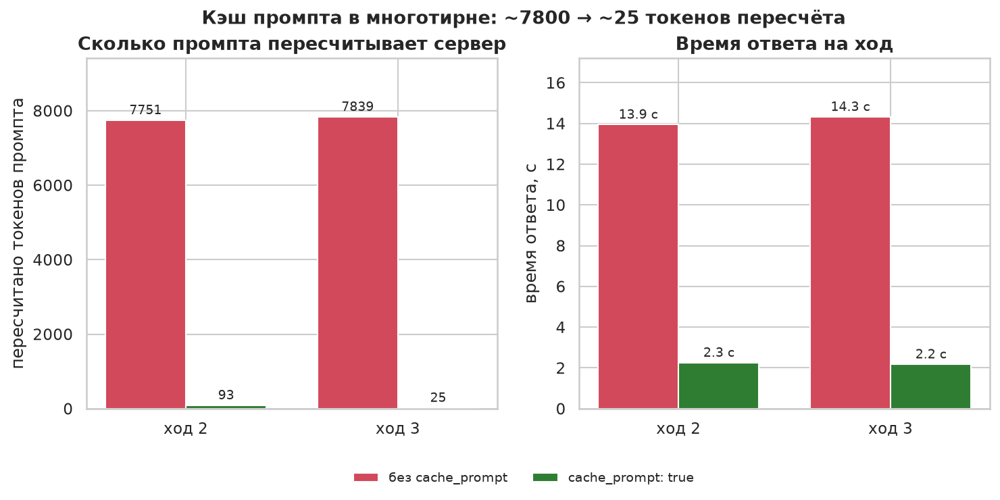

# Длинные сессии и «бесконечный» контекст (llama.cpp + SillyTavern)

Кросс-модельная тема. Наши замеры — `bench\suites\probe\*.json` и `bench\runs\results.jsonl`; внешние
факты — по ссылкам в конце. Дата: 04.10.2026, сборка b11382 (CUDA 12.4), RTX 4060 Ti 16 ГБ.

## 1. Что подтверждено на нашем стенде

- **Промпт длиннее контекста → HTTP 400.** Сервер отвечает `request (N tokens) exceeds the available
  context size` — он НЕ обрезает промпт. Скользящее окно для входящего промпта сервер не делает.
  (Qwen3.6 и Gemma-26B, `probe_q36_overflow.json` / `probe_g26_overflow.json`.)
- **`--context-shift` и `--cache-reuse` у Gemma-4 и Qwen3.5 отключены:**
  `KV cache shifting is not supported for this context` / `cache_reuse is not supported by this context`.
  Флаги можно передать — они молча гасятся.
- Без сдвига генерация останавливается у границы контекста (`n_tokens = n_ctx-1, truncated = 1`).
- **Переиспользование точного префикса работает** (`cache_prompt: true`): в многотирне Qwen PP на 2–3 ходу
  падал с 7 397 до ~110 токенов. У Gemma-4 для этого нужны **SWA-чекпоинты**: с `-ctxcp 0` PP на 3-м ходу
  скакал 470→1790 (полный перепроцессинг), с `-ctxcp 16` — 470.
- Настройки `-ctxcp 16 -cms 512`, `-ctxcp 128 -cms 128` и `+--cache-ram 16000` на коротком аппендиксе
  дают одинаковый результат — для простого многотирна хватает дефолтных.
- **Скорость на глубине** (Qwen3.6, MTP): 103 t/s на 8k → 86 на 32k → 73 на 64k; принятие держится
  ~72–80 %. PP на глубине 32–64k — 1 350–1 600 t/s.
- Vision бесплатен по скорости при `--no-mmproj-offload` (проектор на CPU); `-np 2` для одного
  пользователя — минус ~15 % и контекст делится пополам.

## 2. Почему серверный сдвиг не работает (по коду llama.cpp)

- **Qwen3.5** — это M-RoPE (`n_pos_per_embd() > 1`), а `get_can_shift()` для такого контекста возвращает
  `false`. Никакой флаг не поможет.
- **Gemma-4** — SWA: `llama_kv_cache_iswa::get_can_shift()` требует равенства размеров base- и SWA-кэша,
  что выполняется только при `--swa-full`; но на 16 ГБ `--swa-full` упирается в память (OOM).
- `--context-shift` **выключен по умолчанию с августа 2025** (PR #15416) — он ломает шаблоны современных
  моделей; при выключенном сдвиге сервер превентивно отклоняет промпт, который «съел бы слот».
- **Prompt-level truncation удалён из сервера** (октябрь 2025) и возвращать его не планируют
  (открытый PR #24210). Направление апстрима — чекпоинты + клиентское окно.

## 3. Что реально работает

- **Окно делает клиент** (SillyTavern режет старые сообщения). Задача сервера — не мешать кэшу.
- **Стабильность префикса — важнее всех флагов.** «Вечный» блок в начале (system/persona + постоянный
  World Info + сводка + Author's Note) не менять; история должна быть **append-only**. Если клиент
  переписывает/удаляет старые сообщения или вставляет AN/WI в середину — чекпоинты инвалидируются
  (`forcing full prompt re-processing`) и каждый ход = полный re-prefill. Именно это ломает длинные RP
  у людей на ~46–51k.
- Серверные флаги: `-np 1`, `--cache-ram 8192…16000`, `--cache-idle-slots`, `-ctxcp`/`-cms` (дефолт
  устраивает). `--swa-full` и `--context-shift` — не трогать.
- SillyTavern: Summarize — **только `Classic, blocking`** (raw не рекомендуется для llama.cpp, ломает
  переиспользование префикса); **Chat Vectorization выключить** (перестраивает префикс → cache miss);
  **Smart Context не ставить** (не поддерживается). Обновлять сводку до того, как начнут выпадать
  сообщения.
- Расширения под «настоящее» клиентское окно: **Memory Books** (сцены → memory в лор-книгу → старые
  сообщения скрываются; `Auto-Summary Interval 30`, `Buffer 2`) и **MessageSummarize** (per-message память
  + «заморозка» порога инъекции ради кэша).
- Постоянная память — **constant-лорбук на Depth 3 (system)**, «одна запись = один персонаж» (внешность +
  манера речи). Как показывать длину — словами («3–4 абзаца»), а не токенами.
- Держать фактический промпт ~25–40k, а не «в упор» в 51k: энтропия/деградация внимания растёт с длиной.

## 4. Рецепт под c=51000

- **Бюджет.** В SillyTavern `Context (tokens)` — это максимум промпта **минус длина ответа**. Поэтому
  `Context 51000` + `Response length > 0` не влезет в серверный `-c 51200` и даст 400. Совмещать так:
  сервер `-c 51200`, в ST Context ~48000, Response ~600–1000. Проверять через Prompt Itemization.
- Сервер: `-np 1 -c 51200 -fa on --fit on --load-mode none -ctk q4_0 -ctv q4_0 --cache-ram 8192
  --cache-idle-slots -ctxcp 16 -cms 512` (+ MTP для скорости на Gemma-31B).
- Клиент: Summarize Classic; World Info Budget 10–15 % контекста, Scan Depth 2–4; AN in-chat depth 0–2,
  frequency 1.

## 5. Если серверное окно принципиально

- **KoboldCpp** — Context Shifting включён по умолчанию и работает со SWA (альтернативный рантайм для RP).
- Форк `justinshumaker/llama.cpp-mrope-ctx-shift` (`--ctx-shift-any --keep -3`) — обход M-RoPE, но
  позиции после сдвига приблизительны, тестировался на Qwen3.5-VL; рискованно.
- Ollama-подход — пре-тримка промпта до вызова сервера (работает с любой архитектурой).
- Для кода вместо compaction: **маскирование старых tool-output** (замена плейсхолдерами) не хуже
  LLM-суммаризации (JetBrains NeurIPS 2025) + внешние заметки/файлы вместо переписывания истории.

## 6. Сэмплинг под RP — это качество, не скорость

- Спекуляция **lossless** (отклонённые черновики выбрасываются) — сэмплерами её «чинить» не нужно.
- `repetition-penalty = 1.0`, вместо неё **DRY** (`multiplier 0.08–0.2`, `base 1.75`, `allowed-length 2`,
  breakers для имён); **min-p 0.02–0.05**; **XTC** (threshold ~0.05–0.1 / probability ~0.3–0.6) — как
  «де-слоп», если есть повторы. Mirostat — только отдельным профилем. Не сочетать Smoothing Factor с Min-P.
- Значения выше — ориентир из сообщества (частично 2024 г.), не наши замеры; сверяться с карточкой модели.

## 7. Источники

- llama.cpp: `docs/speculative.md`, `tools/server/README.md`; `src/llama-kv-cache.cpp` (`get_can_shift`),
  `llama-hparams.cpp` (M-RoPE), `tools/server/server-context.cpp`; PR #15293/#13194/#15416/#16391/#24210/#19849.
- Issues: #17284 (400 при переполнении), #21769/#21379/#21831/#24714 (потеря чекпоинтов/перепроцессинг),
  discussion #24944.
- SillyTavern: `docs.sillytavern.app` (summarize, chat-vectorization, smart-context, worldinfo, authors-note,
  prompt-manager, data-bank); extensions `aikohanasaki/SillyTavern-MemoryBooks`, `qvink/SillyTavern-MessageSummarize`.
- Сообщество: r/SillyTavernAI, r/LocalLLaMA (треды про контекст и RP-пресеты), KoboldCpp.

## 8. Не проверено

- Числа сэмплинга из сообщества и «context rot с 32k» — пересказ, не наш бенчмарк.
- Форк M-RoPE shift, KoboldCpp, Memory Books/MessageSummarize на нашей машине не запускались.
- Влияние `q4_1`/`q5_1` для KV (community-приём под 73k) — у нас мерились только q4_0/q8_0.
