# Квантование KV-кэша: насколько это меняет модель

Срез: **2026-10-08**. Стенд: RTX 4060 Ti 16 ГБ, Ryzen 7 5700X, 32 ГБ, b11382.
Модели: **StyleTune-26B-A4B** (Gemma-4, MoE, IQ4_XS) и **Schattenblume-31B**
(Gemma-4, dense, i1-IQ3_XXS). Инструменты: [bench\kv_prompts.py](../../bench/kv_prompts.py),
[bench\kv_quality.py](../../bench/kv_quality.py), [bench\plot_kv.py](../../bench/plot_kv.py), [bench\gguf_info.py](../../bench/gguf_info.py).

## 0. Как правильно поставить вопрос

Наивный вопрос «q4 умнее или глупее f16?» почти всегда даёт «почти незаметно» —
и это правда, но она ничего не объясняет. Правильнее разделить **два эффекта**:

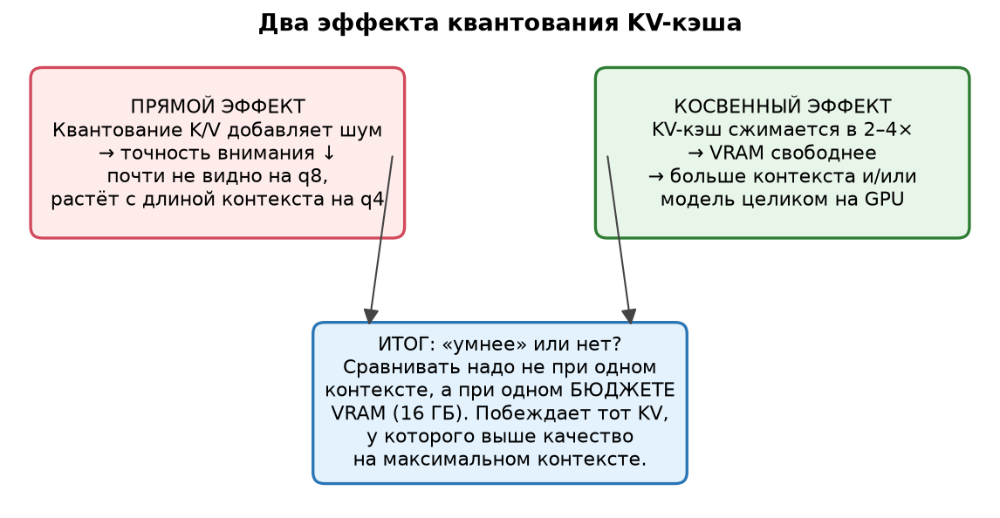

1. **Прямой эффект — цена точности.** Квантование K/V добавляет шум в ключи и
   значения внимания. Это *ухудшает* ответы. На `q8_0` шум ниже уровня шума
   генерации (разницы не видно), на `q4_0` он заметен, и тем сильнее, чем длиннее
   контекст (больше токенов — больше накопленной ошибки).
2. **Косвенный эффект — бюджет.** Сжатый KV-кэш освобождает VRAM. Эту память
   можно потратить на **более длинный контекст** (больше «памяти» у модели) или на
   то, чтобы держать модель целиком на GPU. Это *улучшает* ответы.

**Итог зависит от того, что сравнивать.** Сравнивать «f16 против q4» при одном и
том же контексте — значит мерить только прямой эффект (и найти «q4 чуть хуже»).
Сравнивать надо **при одном бюджете VRAM**: на 16 ГБ `f16` даёт, скажем, 30k
контекста, а `q4_0` — 80k. Выигрывает тот вариант, у которого качество на
*доступном* контексте выше. Именно это и есть ответ на «насколько умнее».

## 1. Почему в наших Gemma-4 KV-кэш — большой рычаг

У Gemma-4 **скользящее окно** (SWA): из каждых 6 слоёв 5 — локальные (окно 1024
токена), 1 — глобальный (видит весь контекст). У локальных и глобальных слоёв
разное число K/V-голов и своя размерность. Поэтому KV растёт не как «длина × все
слои», а в основном за счёт редких глобальных слоёв.

Данные из метаданных GGUF ([bench\gguf_info.py](../../bench/gguf_info.py)):

| | StyleTune-26B-A4B | Schattenblume-31B |
| --- | --- | --- |
| Слоёв | 30 (25 локальных + 5 глобальных) | 60 (50 локальных + 10 глобальных) |
| K/V-головы: локальные / глобальные | 8 / 2 | 16 / 4 |
| Размерность K,V: локальные / глобальные | 256 / 512 | 256 / 512 |
| Окно | 1024 | 1024 |
| Веса на диске | 13 786 МиБ | 11 518 МиБ |

Размер KV-кэша, МиБ (локальные слои ограничены окном, поэтому растут только глобальные):

| | 16k | 33k | 49k | 64k | 131k |
| --- | --- | --- | --- | --- | --- |
| **StyleTune-26B** f16 | 440 | 840 | 1200 | 1480 | 2760 |
| … q8_0 | 234 | 446 | 638 | 786 | 1466 |
| … q4_0 | 132 | 236 | 338 | 416 | 776 |
| **Schattenblume-31B** f16 | 1680 | 3360 | 4800 | 5920 | 11040 |
| … q8_0 | 893 | 1785 | 2550 | 3145 | 5865 |
| … q4_0 | 473 | 945 | 1350 | 1665 | 3105 |

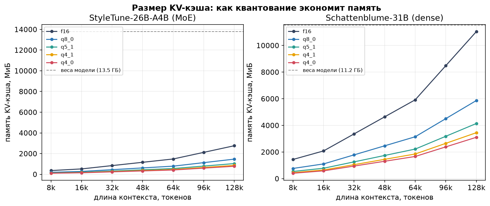

Видно главное: у **dense 31B** на 49k f16-кэш — это 4.8 ГБ (в 16 ГБ вместе с
весами 11.5 ГБ уже не влезает), а `q4_0` — 1.35 ГБ и влезает. У **MoE 26B**
весит больше сама модель (13.5 ГБ), поэтому KV-рычаг скромнее, но тоже реальный.

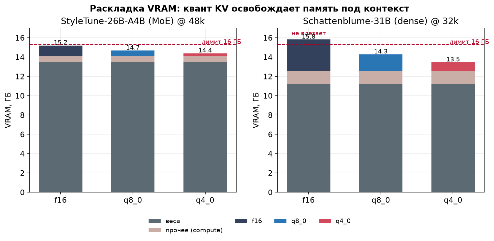

> Сравните с Qwen3.6-35B-A3B: это гибрид linear/full attention, KV-кэш там крошечный
> (q4 vs q8 на 131k — разница ~220 МиБ). То есть **ценность квантования KV зависит
> от архитектуры**: у Gemma-4 SWA это крупный рычаг, у линейных гибридов — почти ноль.

## 2. Гипотезы

- **H1 (цена q8 ≈ 0).** `q8_0` побитово/семантически совпадает с `f16` на коротких
  и средних контекстах.
- **H2 (цена q4 растёт с глубиной).** На 2–16k `q4_0` неотличим; на 48k+ появляются
  редкие промахи памяти.
- **H3 (на RP-креативе цена минимальна).** Креативный текст не требует точного
  извлечения дальних токенов — `q4_0` там почти бесплатен.
- **H4 (выигрыш — в бюджете).** На 16 ГБ `q4_0` позволяет контекст в ~2.5–3 раза
  длиннее, чем `f16`, поэтому на задачах с длинной памятью он в сумме **лучше**.
- **H5 (скорость).** Квантованный KV быстрее. *Проверяется — результат оказался
  неочевидным (см. раздел про скорость).*

## 3. Методика

### 3.1 Что фиксируем, что меняем

Меняется **только тип KV** (`-ctk/-ctv`). Всё остальное одинаково: сборка,
quantization весов, сэмплинг, seed, длина промпта, тексты. Спекуляция
**выключена** — чтобы не путать эффект KV с MTP и не тратить VRAM на драфт.
Типы: `f16`, `q8_0`, `q4_0`, `q8_0 K / q4_0 V` (смешанный).

### 3.2 Промптовые пробы (главное — глазами)

[bench\kv_prompts.py](../../bench/kv_prompts.py) гоняет одни и те же промпты через каждый тип KV и выкладывает
ответы **рядом** в `compare_*.md`:

| Проба | Что проверяем |
| --- | --- |
| `memory_long` | Факты (шрам, страх собак) в **середине 12k-контекста**, вопрос в конце. Помнит ли модель под q4? |
| `long_memory_24k` | Другая деталь (метка «Т-9», смотритель Гвенда) в середине **~20k-контекста** — более глубокий тест памяти. |
| `rule_far` | Инструкция («три пункта с „— ", слово „маяк"») в середине 12k. Удерживаются ли служебные детали? |
| `creative_ru` | Короткий креатив на `temp 0.85` — глитчи, повторы, англ. вставки. |
| `reason_ru` | Короткий вывод, `temp 0` — контроль: тут разницы быть не должно. |

Плюс автоматические флаги к каждому ответу: доля кириллицы, максимальный
повторяющийся n-грамм, число латинских слов — чтобы «на глаз» подкрепить числом.

### 3.3 Числовая проба — NIAH

[bench\kv_quality.py](../../bench/kv_quality.py) кладёт в контекст уникальные «коды» и просит их назвать
(needle-in-a-haystack). Два режима: одна игла на глубинах 10/50/90 % и **пять игл**
на 5/25/50/75/95 %. Второй режим чувствительнее и, главное, показывает *какие
именно* глубины теряются.

**Важная оговорка о чтении NIAH.** Сравнивать типы KV надо **внутри одного
контекста** (там сено и коды идентичны — сравнение парное). Между разными длинами
контекста сено разное, поэтому recall между 16k и 49k напрямую не сравнивать.

### 3.4 PPL

`llama-perplexity` на русском корпусе Чехова (`-c 512`, [bench\quality\corpus](../../bench/quality/corpus)).
Работает для **dense** 31B; для MoE 26B инструмент врёт (см. `why-ru-models.md`),
там языковую верность отдельно не снять. PPL — «языковая верность» (ось A), а не
связность; высокая чистота ≠ хорошее владение языком.

## 4. Результаты

### 4.1 Примеры ответов (f16 / q8_0 / q4_0)

Полные сравнения — `bench\runs\kv_prompts\run\compare_*.md`. Объективные проверки
(названы ли обязательные факты) — [bench\kv_prompt_checks.py](../../bench/kv_prompt_checks.py):

| Проба (что обязано быть) | StyleTune-26B: f16 / q8 / q4 / смеш | Schattenblume-31B: f16 / q8 / q4 / смеш |
| --- | --- | --- |
| **Память 12k** (шрам + ладонь + собака) | ✓✓✓ / ✓✓✓ / ✓✓✓ / ✓✓✓ | ✓✓✓ / ✓✓✓ / ✓✓✓ / ✓✓✓ |
| **Память 20k** (метка «Т-9» + Гвенда + башня) | ✓✓✓ / ✓✓✓ / ✓✓✓ / ✓✓✓ | ✓✓✓ / ✓✓✓ / ✓✓✓ / ✓✓✓ |
| **Инструкция 12k** (слово «маяк» + 3 пункта) | ✓✓ / ✓✓ / ✓✓ / ✓✓ | ✓✓ / ✓✓ / ✓✓ / ✓✓ |
| **Вывод** (ответ «9») | ✓ / ✓ / ✓ / ✓ | ✗ / ✗ / ✗ / **✓** |

**Все проверки памяти и инструкций прошли у всех типов KV на обеих моделях.**
Разница между типами KV не изменила ни одного факта.

**Память работает одинаково (12k и 20k).** Например, Schattenblume на 12k:

- **f16:** «…в памяти вспыхнул тот старый сарай, запах гнили и рычание своры…»
  и «…старый шрам на ладони натянулся и запульсировал».
- **q4_0:** «…будто я снова в том проклятом сарае, где стены сжимались…»
  и «…шрам на коже натянулся и зазудел».

Оба варианта вспомнили и боязнь собак, и шрам — то есть **извлечение детали с
глубины 6–10 тыс. токенов не пострадало от q4_0**. То же на 20k (метка «Т-9» и
смотритель Гвенда) — слово в слово у f16, q8_0 и смешанного.

**Инструкция с глубины тоже держится** у всех: три пункта с «— » и слово «маяк»
в конце. Более того, модель под всеми KV правильно поняла, что сено — это Чехов
(«Смерть чиновника», «Лошадиная фамилия»), т.е. смысл длинного контекста не поплыл.

**Единственный артефакт, который можно привязать к типу KV** — в конфиге
`q8_0 K / q4_0 V` у StyleTune-26B выползла BPE-склейка с латиницей: «…разрывая
тишину **заcus**ной возни…». У f16/q8_0/q4_0 её нет. Но это один случай (n=1), и
он относится к **смешанному** конфигу, а не к чистому q4_0.

**Глитчи бывают и на f16.** В креативе у Schattenblume под **f16** и под q4_0
одинаково встретилось слово «дожга» (вместо «дождя»), под q4_0 — англ. «illuminating».
То есть порча текста появляется независимо от кванта KV — это свойство модели, а
не следствие сжатия кэша.

**Провал в мини-задаче у 31B — не про KV.** Ответ должен быть «9», но Schattenblume
дал: f16 → «11», q8_0 → «11», q4_0 → «14», смешанный → «12 … **9**» (сам себя
поправил). Ошибка немонотонна по битам и есть даже на f16 — это слабость самого
судья-вывода у модели, а не эффект кванта.

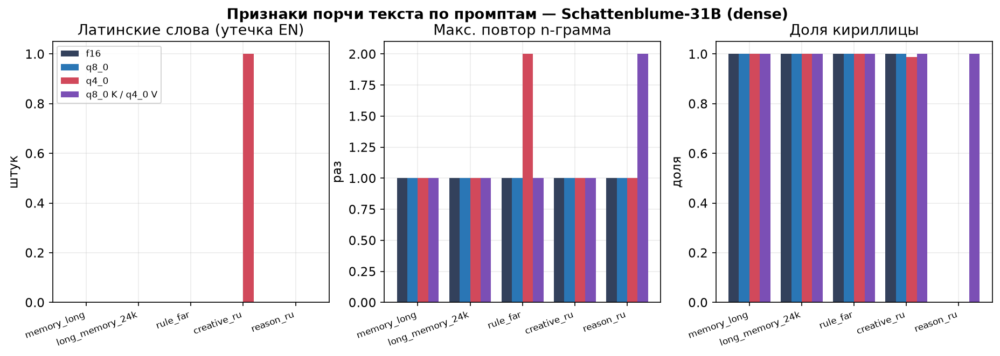

*Латинские слова и повторы появляются у разных типов KV вразнобой; доля кириллицы
≈1.0 везде. Систематического сдвига нет.*

### 4.2 NIAH и PPL

NIAH, проба «5 игл» (доля найденных из 5; одна игла на глубинах 10/50/90 %
**всегда 1.00 у всех**):

| Модель | Контекст | f16 | q8_0 | q4_0 | q8_0 K / q4_0 V |
| --- | --- | ---: | ---: | ---: | ---: |
| StyleTune-26B-A4B | 16k | 0.8 | 0.8 | 0.8 | 0.8 |
| StyleTune-26B-A4B | 48k | 1.0 | 1.0 | 1.0 | 1.0 |
| Schattenblume-31B | 16k | 0.6 | 0.6 | 0.6 | 0.6 |
| Schattenblume-31B | 24k | 1.0 | 1.0 | 1.0 | 1.0 |
| Schattenblume-31B | 48k | — | 1.0 | 1.0 | — |

**Внутри каждого контекста все четыре типа KV дали идентичный результат — вплоть
до того, какие именно иглы потеряны.** Отдельно и наглядно:

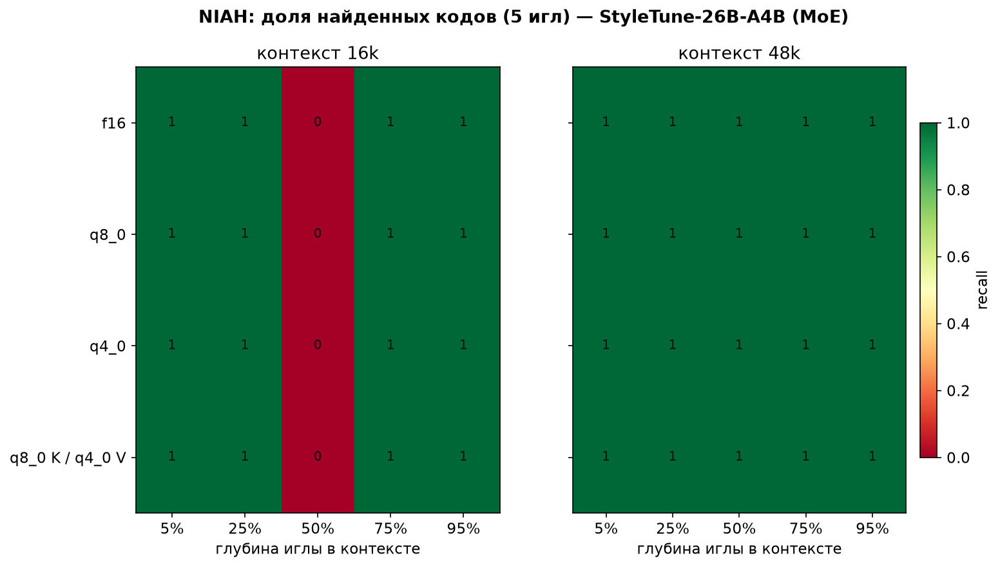

*На 16k все четыре строки краснеют ровно в одном и том же месте (игла на 50 %).
Это сложность конкретной пробы, а не квант: f16 «теряет» ровно ту же иглу, что q4_0.*

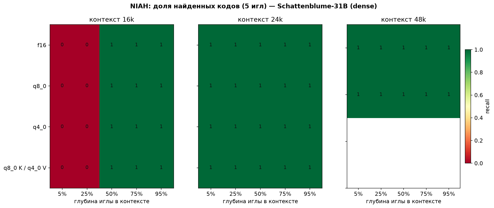

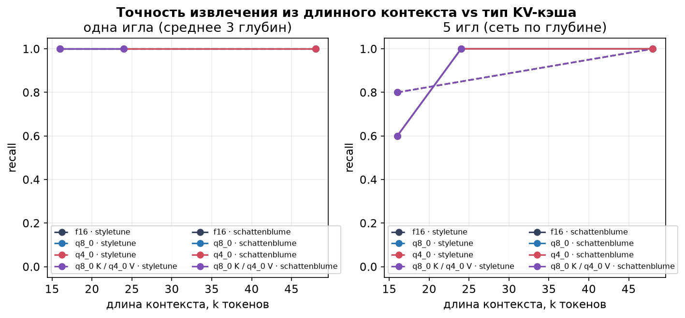

**PPL (Schattenblume-31B, русский корпус Чехова, `-c 512`)**: f16 **1455** ·
q8_0 **1443** · q4_0 **1292** · q8_0K/q4_0V **1367**. Разброс ±11 % — это **шум**
(методика репозитория прямо оговаривает: различия <20 % требуют повторов), и
направления нет — q4_0 оказался даже «лучше» f16. Абсолютное значение высокое —
это свойство модели на литературном русском (ср. Artemis-31B = 983 в
`why-ru-models.md`), а не следствие KV.

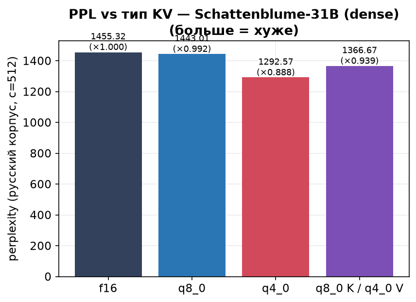

> **Метрика решает ответ.** Наши пробы (recall, факты, PPL) разницы не видят, но
> **KL-дивергенция** — видит: по внешним замерам у Gemma-4 сдвиг заметен уже на
> `q8_0`. Разбор чужих данных (tool/JSON, код, attention sinks, многотирн) —
> [docs\research\kv-cache-external.md](kv-cache-external.md).

### 4.3 Функциональная канарейка: tool/JSON и код

Отдельный тест «по мотивам» kv-canary (см. `kv-cache-external.md`): проверяет не
recall, а **функциональный** результат. Харнесс — [bench\kv_canary.py](../../bench/kv_canary.py)
(набор [bench\suites\kv\kv_canary.json](../../bench/suites/kv/kv_canary.json)), разбор сидов — [bench\kv_code_seeds.py](../../bench/kv_code_seeds.py).

- **tool/JSON**: 12 кейсов. Список инструментов лежит в **начале ~8k-контекста**,
  правила-умолчания — в конце; считаем валидность JSON, верную функцию, верные
  аргументы.
- **код**: 4 маленькие функции, исполняем с тестом (`pass@1`).

| | JSON валиден | верная функция | верные аргументы | код pass@1 (жадно) |
| --- | ---: | ---: | ---: | ---: |
| StyleTune-26B / f16, q8_0, q4_0 | 1.00 | 1.00 | 1.00 | 1.00 |
| Schattenblume-31B / f16, q8_0 | 1.00 | 1.00 | 1.00 | 1.00 |
| Schattenblume-31B / **q4_0** | 1.00 | 1.00 | 1.00 | **0.75** |

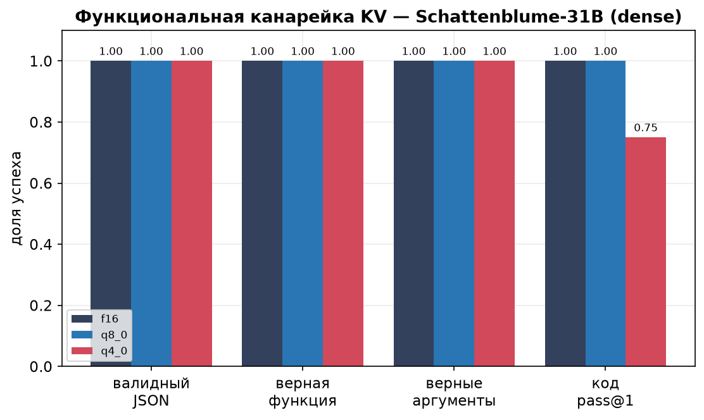

**Tool/JSON не пострадал вообще** — 12/12 у всех шести конфигов (обе модели,
f16/q8_0/q4_0), включая правила-умолчания и инструменты, вытащенные с глубины 8k.

**Единственный функциональный сигнал — формат кода.** При жадном декодировании
31B на `q4_0` написал `add` **на JavaScript**, а на f16/q8_0 — на Python. Проверил
температурой (`temp 0.7`, 10 сэмплов на задачу, [bench\kv_code_seeds.py](../../bench/kv_code_seeds.py)):

| Модель | f16 | q8_0 | q4_0 |
| --- | ---: | ---: | ---: |
| StyleTune-26B | 40/40 | 40/40 | 40/40 |
| Schattenblume-31B | 36/40 | 36/40 | **33/40** |

Весь разрыв у 31B — это **JS вместо Python на одной неоднозначной задаче** (`add`:
7 раз из 10 на q4_0 против 4 из 10 на f16/q8_0). На остальных трёх задачах — 100 %
у всех. То есть q4_0 не «сломал код» и не «сломал JSON»: он **сдвинул выбор языка**
на пограничном промпте — ровно тот класс «другой ответ, а не поломка», о котором
пишут снаружи.

**Оговорки:** контекст тут короткий (~8k), кейсов немного (12), модели — RP-тюны, а
не агентные. Это **не** опровергает более жёсткие внешние данные (там 32k+, реальные
агентные лупы, KL-дивергенция и reasoning-бенчи) — просто на нашем стенде и на
наших задачах запас прочности у Gemma-4 оказался достаточным.

## 5. Скорость

Скорость генерации (t/s, без спекуляции, из NIAH-матрицы на самом длинном запросе):

| Модель | Контекст | f16 | q8_0 | q4_0 | q8_0 K / q4_0 V |
| --- | --- | ---: | ---: | ---: | ---: |
| StyleTune-26B-A4B | 16k | **55.6** | 52.7 | 54.8 | 48.3 |
| StyleTune-26B-A4B | 48k | **50.6** | 37.9 | 40.3 | 36.6 |
| Schattenblume-31B | 16k | **13.6** | 12.4 | 12.7 | 11.7 |
| Schattenblume-31B | 24k | **13.1** | 11.4 | 11.9 | 10.8 |
| Schattenblume-31B | 48k | — | 10.9 | **10.5** | — |

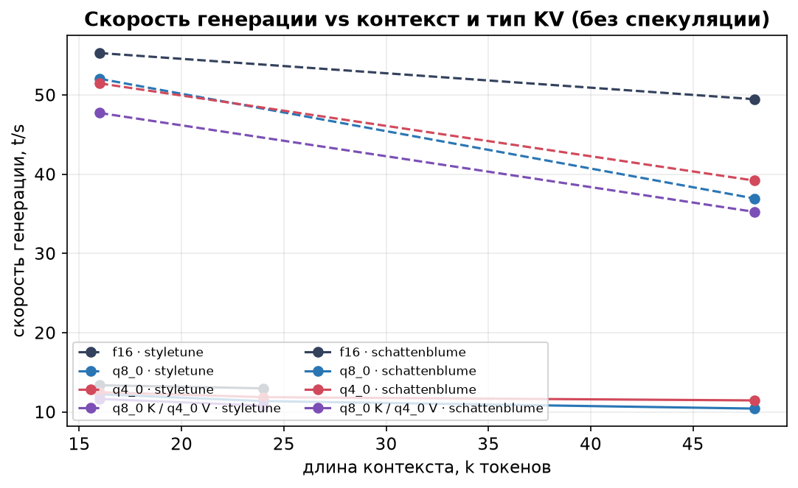

**Неожиданный, но устойчивый результат: `f16` не медленнее, а чаще быстрее
квантованного KV.** FlashAttention считает f16 нативно, тогда как `q8_0` требует
де-квантования блока на каждом шаге внимания — поэтому `q8_0` стабильно самый
медленный, а `q4_0` ближе к f16. Смешанный `q8_0 K / q4_0 V` — самый медленный
(у профиля де-квантования плохой «расклад»). На 48k у 26B разрыв большой:
f16 50.6 против q8_0 37.9 t/s.

**Это уточняет прежнюю запись README «KV `q4_0` быстрее `q8_0` на 10–15 %»:** у
Gemma-4 на этом стенде порядок `f16 ≥ q4_0 > q8_0`, а **выигрыш `q4_0` — не в
скорости, а в памяти**.

Фактическая VRAM (после загрузки, МиБ) и экономия `q4_0` относительно f16:

| Модель | Контекст | f16 | q4_0 | экономия |
| --- | --- | ---: | ---: | ---: |
| StyleTune-26B-A4B | 16k | 14926 | 14468 | 458 |
| StyleTune-26B-A4B | 48k | 15594 | 14772 | 822 |
| Schattenblume-31B | 16k | 14915 | 13168 | 1747 |
| Schattenblume-31B | 24k | 15562 | 13420 | 2142 |

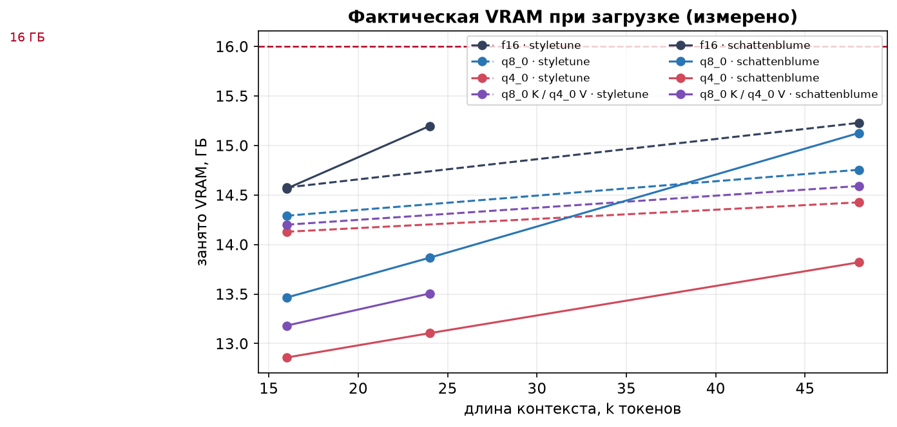

## 6. Практические выводы

Короткий ответ на вопрос «насколько умнее сделает квантование KV»:

1. **Прямого выигрыша в «уме» нет** — вплоть до 49k `f16`, `q8_0`, `q4_0` и
   смешанный дали **неразличимое качество**: одинаковый recall (вплоть до того,
   какие иглы потеряны), одинаковые факты в промптах, PPL в пределах шума. Ошибки
   и глитчи встречаются у всех типов, включая f16.
2. **Косвенный выигрыш — это контекст.** На 31B `f16` в 16 ГБ влезает лишь до
   ~26k, а `q4_0` — до ~116k. Если задаче нужна память на 30k+, `q4_0` —
   **единственный вариант**, и он даёт качество, недостижимое на f16 в принципе.
   На MoE-26B рычаг меньше (веса модели 13.5 ГБ доминируют), но реален: f16 ~54k
   против q4_0 ~216k.
3. **Скорость — не аргумент за квант KV** (на этом стенде `f16` быстрее), в
   отличие от квантования весов модели.

**Что выбирать:**

| Ситуация | Тип KV | Почему |
| --- | --- | --- |
| Нужен максимальный контекст (31B, длинная память, RAG, книги) | **`q4_0`** | f16 выше ~30k физически не влезает; q4_0 даёт те же ответы и влезает |
| Контекст ≤ ~25k, всё помещается | **`f16`** | точность эталонная, и он же самый быстрый |
| Промежуточный `q8_0` | ⚠️ смысла мало | на этом стенде он и медленнее f16/q4_0, и не даёт выигрыша по качеству |
| Смешанный `q8_0 K / q4_0 V` | ❌ | самый медленный; единственный замеченный KV-связанный глитч — у него |

**Практическое правило:** *квантуйте KV только ради памяти и контекста, и берите
самый «дешёвый, который влезает»* — при равном бюджете VRAM `q4_0` почти всегда
оптимален, потому что покупает контекст бесплатно (по качеству). Если контекст не
нужен — не квантуйте: `f16` не хуже по качеству и быстрее.

> Оговорка: всё выше — про **Gemma-4** (SWA, крупный KV) на 16 ГБ. У линейных
> гибридов (Qwen3.5/3.6) KV-кэш крошечный, и весь этот рычаг почти обнуляется;
> там квант KV нужен скорее для формальной экономии VRAM.

## 7. Что не проверено

- **Функциональные риски**: JSON/tool-calling, pass@1 кода, IFEval, многотирн на
  наших моделях вживую не гоняли (внешние данные — `kv-cache-external.md`;
  особенно чувствительна Gemma). Их нельзя закрыть recall'ом или PPL.

- Контексты 80k+ на 31B вживую (расчёт говорит: `q4_0` влезает, f16 — нет).
- `q5_1`, `q4_1`, `iq4_nl` вживую не измерялись (только расчёт памяти).
- Многотирновая деградация (20+ ходов) — только одиночные ответы.
- Влияние на think-режим (здесь всё в non-think).
- Повторы PPL (различия <20 % на одном прогоне недостоверны).
